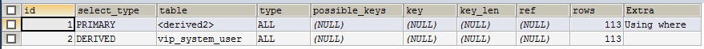
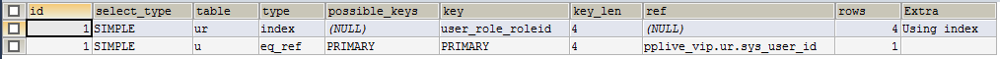
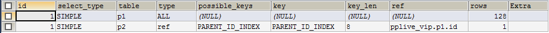

## MySQL Explain 详解 ##
### id 列 ###

　　从ID列可以判断SQL的执行顺序：从大到小，如果ID相同，就从上到下执行。如果行引用联合结果的其他行，那么它的值可能为NULL，这种情况下，table列的值会显示为`<unionM,N>`来指明行引用的是联合行中的带有指定`M,N`值的ID。

----------

### select_type 列 ###

- **SIMPLE**  
简单的 `SELECT` 语句（没有使用 `union` 或者 子查询）  

- **PRIMARY**  
最外层的 `SELECT` 语句  

- **UNION**  
在一个 `UNION` 语句中第二或之后的SELECT语句  

- **DEPENENT_UNION**  
在一个 `UNION` 语句中第二或之后的 `SELECT` 语句，取决于外层的查询  

- **UNION_RESULT**  
`UNION` 的结果集  

- **SUBQUERY**  
子查询中的第一个 `SELECT`  

- **DEPENENT_SUBQUERY**  
子查询中的第一个 `SELECT` ,取决于外层的查询

- **DERIVED**  
`SELECT` 的驱动表（ `FROM` 子查询）

- **MATERIALIZED**  
物化子查询  

- **UNCACHEABLE SUBQUERY**  
不能将结果缓存的子查询，必须重新计算外部查询的每一行  

- **UNCACHEABLE UNION**  
在一个 `UNION` 中第二或之后的 `SELECT` 查询属于` UNCACHEABLE SUBQUERY`（请看 `UNCACHEABLE SUBQUERY` )  

- **特别声明**  
**`DEPENDENT`**：典型代表就是使用了相关子查询。（相关子查询：子查询里包含了一个同时在子查询里，又在外部查询的表的查询）  
**`DEPENDENT SUBQUERY`**: 它不同于 `UNCACHEABLE SUBQUERY` 的求值。对于 `DEPENDENT SUBQUERY` ，子查询对于外部上下文里每一个集合中不同的变量值仅仅重新计算一次。而对于 `UNCACHEABLE SUBQUERY`，子查询对于外部上下文里的每一行都会重新计算一次。  

----------

### table 列 ###
SQL中使用到的表。它的值也可为下面的其中之一：  

- **`<unionM,N>`**: 行引用了带有值为 `M,N` 的查询ID的联合行  
- **`<derivedN>`**: 行引用了值为 `N` 的ID的驱动表结果。例如，它是从 `FROM` 子查询中的结果形成的驱动表的结果集  

　　例：`EXPLAIN SELECT * FROM (SELECT * FROM vip_system_user) b WHERE b.id>57`  

　　　　

- **`<subqueryN>`**: 行引用了一个值为 `N` 的ID的　`materialized subquery`（物化子查询）的结果。

----------

### partitions 列 ###
查询中所匹配的记录所在的分区。这列只有在使用了 `PARTITIONS` 关键字时才会显示。对于没有使用分区表的，该值为NULL

----------

### type 列 ###

----------

连接类型  

- **system**  
表只有一行（=system table）。这个是 `const` 连接类型的一个特例。  

- **const**  
该表最多只有一条匹配的行，这是读取查询的开始。因为这里只有一行，该行这列的值可以被优化器的剩余部分认为是常量。const表是非常快的，因为它们只会读取一次。  
`const` 用于当你与***主键*** 或者***唯一索引***的所有部分比较的是***常量***值时。在以下的查询中，tal_name 可以被用作const表：  

　　`select * from tbl_name where primary_key = 1;`  
　　`select * from tbl_name where primary_key_part1 = 1 and primary_key_part2 = 2`

- **eq_ref**  
从该表中读取一行与前一张表的所有行的每一种组合。除了 `system` 和 `const` 类型，这可能是最好的连接类型了。它通常于用在连接时使用了索引的所有部分，并且索引是一个***主键索引***或者***唯一非空索引***。

　　例：`EXPLAIN SELECT u.user_name FROM vip_system_user_role ur LEFT OUTER JOIN vip_system_user u ON ur.sys_user_id=u.id`  

　　　　  

- **ref**  
所有索引匹配的行的值与前一张表的所有行的每一种组合。ref用于连接仅使用最左前缀索引或者索引不是主键索引，唯一索引（换句话说，连接不能基于该索引值选择一行 ）。如果索引用于匹配少数行，这是一个好的连接类型。`ref` 能够用于使用 `=` 或者 `<=>` 操作符的索引列中。  

　　例：`EXPLAIN SELECT * FROM vip_system_permission p1 LEFT OUTER JOIN vip_system_permission p2 ON p1.id=p2.parent_id`

　　　　  

- **fulltext**  
这个连接使用fulltext索引执行  

- **ref_or_null**  
这个连接类型是类似ref，但有些额外的不同：MySQL要做一些额外操作去搜索包含NULL值的行。这个连接类型通常用于优化执行子查询  

- **index_merge**
- **unique_subquery**
- **index_subquery**
- **range**
- **index**
- **ALL**

### possible_keys 列 ###

----------

### key 列 ###

----------

### key_len 列 ###

----------

### ref 列 ###

----------

### rows 列 ###

----------

### filtered 列 ###

----------

### extra 列 及常见的值 ###